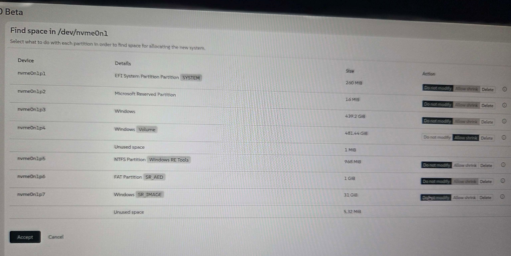
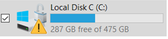

# Installation openSUSE Leap 16 Beta on HP Elitebook 840 G11 (Dualboot) and use Dell U3425we as Hub-Monitor

I spend some time, to get openSUSE Leap 16 up and running on my new HP Elitebook 840 G11 with my Dell U3425we Hub-Monitor.
<br><br>
Here are some hints for the installation:<br>
<br>
1. Reduce the Windows Partion to get space for Linux<br>
During the installation, I have not found a way to reduce the size of the Windows partition. Therefore I created the partition under Windows with Disk Management (diskmgmt.msc)
Then you can choose the free partion during the installation via the Agama-Installer    
<p>
&nbsp;&nbsp;&nbsp;&nbsp;&nbsp;&nbsp;
</p>
&nbsp;&nbsp;&nbsp;&nbsp;&nbsp;&nbsp;I installed openSUSE on nvme0n1p4 with action "Delete" and not "allow shrink"
<br>
<br>
2. Install from USB stick
<br>
&nbsp;&nbsp;&nbsp;&nbsp;&nbsp;&nbsp; To get into the BIOS, press ESC serveral times during startup
<br>
&nbsp;&nbsp;&nbsp;&nbsp;&nbsp;&nbsp; Then choose "Boot Menu (F9)" from the BIOS menu and select your USB stick to install openSUSE
<br>
&nbsp;&nbsp;&nbsp;&nbsp;&nbsp;&nbsp;I had to disable secure boot in the BIOS.
<br>
<br>
3.  WiFi works out of the box :smile:
<br>
<br>
4. Audio / Sound<br>
&nbsp;&nbsp;&nbsp;&nbsp;&nbsp;&nbsp; Do not  works out of the box<br>
&nbsp;&nbsp;&nbsp;&nbsp;&nbsp;&nbsp; Install "sof-firmware"<br>
<br>
<br>
5. Mount Windows Partion<br>
&nbsp;&nbsp;&nbsp;&nbsp;&nbsp;&nbsp;If you see a yellow warning triangle on your windows drive like:
<p>
   &nbsp;&nbsp;&nbsp;&nbsp;&nbsp;&nbsp;
</p>
&nbsp;&nbsp;&nbsp;&nbsp;&nbsp;&nbsp;Then your Bitlocker encryption is not complete. Just complete your Bitlocker encryption(https://itler.net/laufwerk-mit-orangen-warndreieck-und-ausrufezeichen)
<br>
&nbsp;&nbsp;&nbsp;&nbsp;&nbsp;&nbsp;Now you cann access your Windows drive via Dolphin. You have to enter two passwords. The first one is the Bitlocker-Key and the second one is your password. 
&nbsp;&nbsp;&nbsp;&nbsp;&nbsp;&nbsp;If you do not need a Bitlocker encryption on your Windows Drive, you can decativate your Bitlocker encryption after the successfull encryption.
<br>
<br>
6. Problems with Dockingstation (Dell Monitor U3425we)<br>
<br>
&nbsp;&nbsp;&nbsp;&nbsp;&nbsp;&nbsp;6.1 Change Bios Settings
<br>
&nbsp;&nbsp;&nbsp;&nbsp;&nbsp;&nbsp;&nbsp;&nbsp;&nbsp;&nbsp;&nbsp;&nbsp;Disable FastBoot:<br>
&nbsp;&nbsp;&nbsp;&nbsp;&nbsp;&nbsp;&nbsp;&nbsp;&nbsp;&nbsp;&nbsp;&nbsp;After disabling FastBoot, I can use mouse and keyboard on the GRUB screen.<br>
&nbsp;&nbsp;&nbsp;&nbsp;&nbsp;&nbsp;&nbsp;&nbsp;&nbsp;&nbsp;&nbsp;&nbsp;Also the monitor speakers works after disabling FastBoot.
<br>
&nbsp;&nbsp;&nbsp;&nbsp;&nbsp;&nbsp;&nbsp;&nbsp;&nbsp;&nbsp;&nbsp;&nbsp;Boot on Power:<br>
&nbsp;&nbsp;&nbsp;&nbsp;&nbsp;&nbsp;&nbsp;&nbsp;&nbsp;&nbsp;&nbsp;&nbsp;If you want, that the Laptop boots, when you connect Thunderbold (Boot on Power)<br>
&nbsp;&nbsp;&nbsp;&nbsp;&nbsp;&nbsp;&nbsp;&nbsp;&nbsp;&nbsp;&nbsp;&nbsp;Disable "HP Powermangement" and enable "Boot on Power" in the BIOS<br>
<br>
&nbsp;&nbsp;&nbsp;&nbsp;&nbsp;&nbsp;6.2 Change GRUB2 stetting <br>
&nbsp;&nbsp;&nbsp;&nbsp;&nbsp;&nbsp;&nbsp;&nbsp;&nbsp;&nbsp;&nbsp;&nbsp;During the start up, no login screen after booting.<br>
&nbsp;&nbsp;&nbsp;&nbsp;&nbsp;&nbsp;&nbsp;&nbsp;&nbsp;&nbsp;&nbsp;&nbsp;There, I had to enforce to use the montior screen.
<br>
&nbsp;&nbsp;&nbsp;&nbsp;&nbsp;&nbsp;&nbsp;&nbsp;&nbsp;&nbsp;&nbsp;&nbsp;First, get your display via

``` 
        xpandr
```
  
&nbsp;&nbsp;&nbsp;&nbsp;&nbsp;&nbsp;&nbsp;&nbsp;&nbsp;&nbsp;&nbsp;&nbsp;I get: DP-3
<br>
&nbsp;&nbsp;&nbsp;&nbsp;&nbsp;&nbsp;&nbsp;&nbsp;&nbsp;&nbsp;&nbsp;&nbsp;Extend GRUB_CMDLINE_LINUX with "video=DP-3:D video=eDP:e" in /etc/default/grub and generate the new grub config [^2]
<br>
<br>
&nbsp;&nbsp;&nbsp;&nbsp;&nbsp;&nbsp;&nbsp;&nbsp;&nbsp;&nbsp;&nbsp;&nbsp;Still open: Login screen lauches only with the resolution of 640x480. But after login, I have my preferd resultion.<br>

[^1]:https://itler.net/laufwerk-mit-orangen-warndreieck-und-ausrufezeichen
[^2]:https://superuser.com/questions/1583625/display-grub-on-external-monitor-with-docking-station
